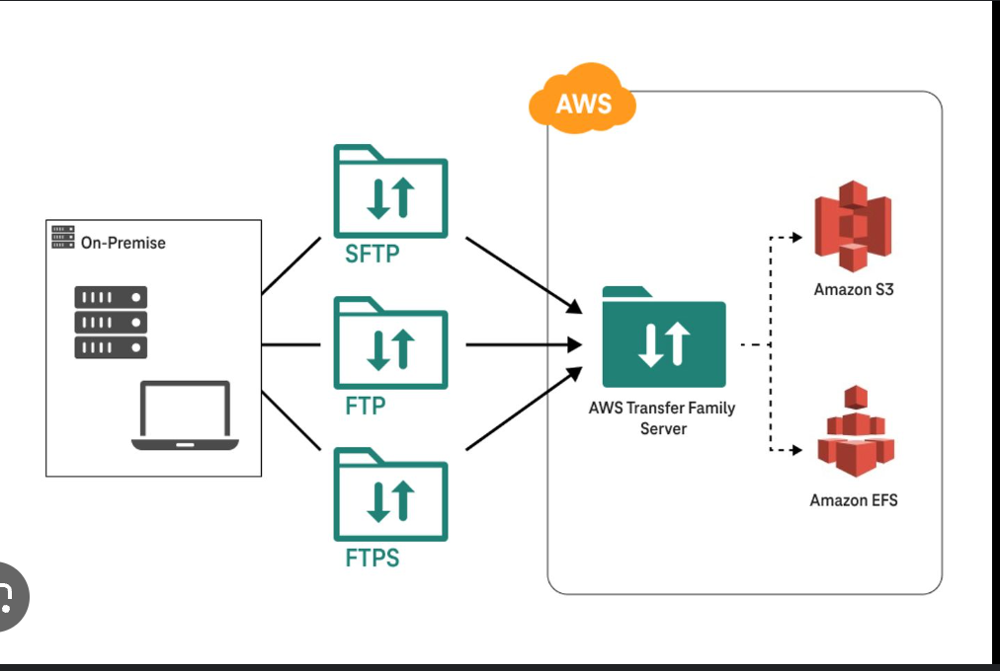
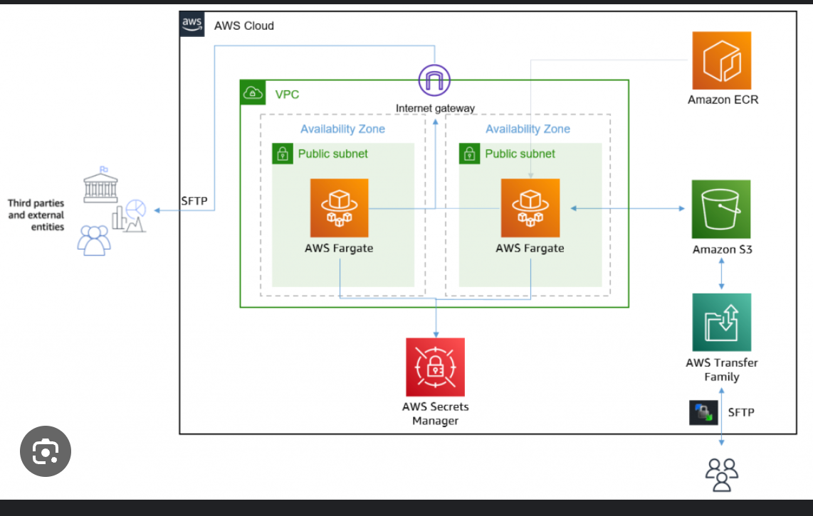

# AWS Transfer Family

- Is a product which provides managed file transfer service
- It allows us to transfer files to/from `S3 or EFS`
- It provides `managed servers` which provides various protocols. Allows us to upload/download data to S3 or EFS using protocols different the ones natively supported by S3 or EFS
- Allow us to interact with both of these services using the following protocols:
    - FTP (File Transfer Protocol): unencrypted file transfer protocol
    - FTPS (File Transfer Protocol Secure): file transfer protocol with TLS encryption
    - `SFTP` (SSH File Transfer Protocol): file transfer over SSH
    - Applicable Statement 2 (AS2): transfer structured B2B data
- Transfer Family supports a wide range of identities: service managed, Directory Service, custom (Lambda/APIGW)
- Managed File Transfer Workflows (MFTW): serverless file workflow engine:
    - Can be used when file are uploaded, `we can define workflows` as to what happened to the file as it gets uploaded

## Transfer Family Endpoint Types

- Within Transfer Family we create servers which we can think of as the front-end accesspoint to our storage
- They present S3 and EFS via one or more supported protocol
- How we access these servers depends on how configure the service's endpoints:
    - `Public`: runs on the AWS public zone, accessible to the `public internet`
        - No networking components to configure
        - Only supported protocol is `SFTP`
        - The endpoint has a `dynamic IP` which can change, we should use `DNS` to access it
        - We `can't control` who will access it using features such as NACLs or security groups
    - VPC - Internet Access
        - Runs in a VPC
        - We can use SFTP/FTPS and AS2 protocols
        - Anything that has connectivity to the VPC (DX/VPN) can access it as it was running inside the VPC
        - Transfer Family provides a `static IP` for it
        - SG/NACLs are supported
        - It is allocated an `Elastic IP for it which is static, which allows it to be accessed over the public internet`
    - VPC - Internal
        - Runs inside a VPC
        - We can use SFTP/FTPS/FTP and AS2 protocols
        - Anything that has connectivity to the VPC (DX/VPN) can access it as it was running inside the VPC
        - Transfer Family provides a static IP for it
        - SG/NACLs are supported

## Other Features

- It is `multi-AZ` => resilient and scalable
- Cost is based for provisioned server per hour + data transfer
- With FTP/FTPS only Directory Service and Custom IDP is supported
- `FTP can only be used internally within a VPC`
- AS2 has to be VPC Internet/Internal only, we cannot use the public endpoint type
- Use cases for Transfer Family:
    - In case we need access to S3/EFS but using the supported protocols
    - Integration with existing workflows
    - Using `MFTW` to create new workflows