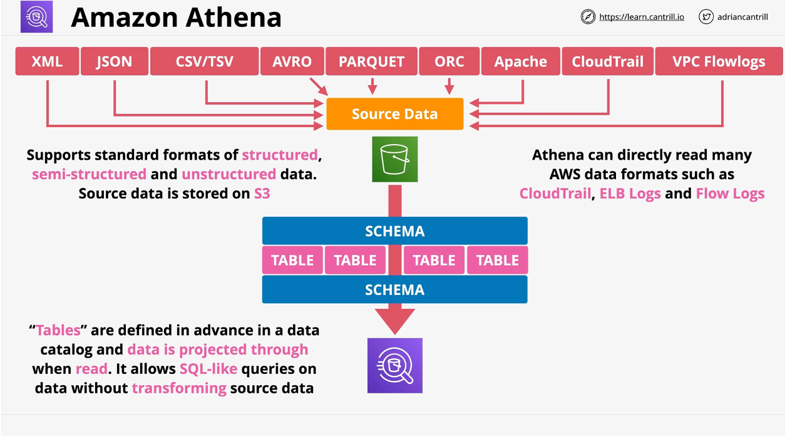

# Amazon Athena

- It is a serverless interactive querying service, based on `presto` engine.
- We can take data stored in S3 and perform ad-hoc queries on the data paying only for the data consumed
- Athena uses a process named **Schema-on-read**.
- No need of ETL here as it uses schema on read.
- Original data in S3 is never changed, it remains in its original form. It is translated to the predefined schema when it is read for processing
- Supported formats by Athena: XML, JSON, CSV/TSV, AVRO, PARQUET, ORC, Apache, CloudTrail, VPC Flowlogs, etc. 
- Supports standard formats of `structured data, semi-structured and unstructured data`

- "Tables" are defined in advance in a data catalog and data is projected through when read. `It allows SQL-like queries on data without transforming source data`
- It is preferred for querying AWS logs: VPC Flow Logs, CloudTrail, ELB logs, cost reports, etc.
- Can query data form Glue Data Catalog and Web Server Logs
- **Athena Federated Query**: Athena now supports querying other data sources than S3. `Requires a data source connector (AWS Lambda)`, This connector is a lambda function.